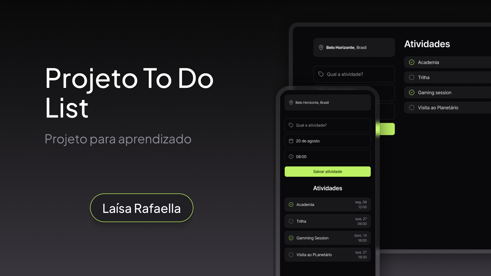

<h1 align="center"> To do List </h1>

  <a href="#-tecnologias">Tecnologias</a>&nbsp;&nbsp;&nbsp;|&nbsp;&nbsp;&nbsp;
  <a href="#-projeto">Projeto</a>&nbsp;&nbsp;&nbsp;|&nbsp;&nbsp;&nbsp;
  <a href="#-layout">Layout</a>&nbsp;&nbsp;&nbsp;|&nbsp;&nbsp;&nbsp;
  <a href="#memo-licença">Licença</a>

  

 

   

## 🚀 Tecnologias

Esse projeto foi desenvolvido com as seguintes tecnologias:

- HTML e CSS
- JavaScript
- Git e Github
- Figma
- Biblioteca Day JS

## 💻 Projeto

O To Do List é uma lista de tarefas com o objetivo de organizar a rotina e as tarefas do dia, da semana ou do mês.

- [Acesse o projeto finalizado, online](https://laisarafaella.github.io/to-do-list)

## 🔖 Layout

O projeto foi desenvolvido no [Figma](https://figma.com).

## :memo: Licença

Esse projeto está sob a licença MIT.

---

Feito com ♥ by Laísa Rafaella :wave: :blue_heart: